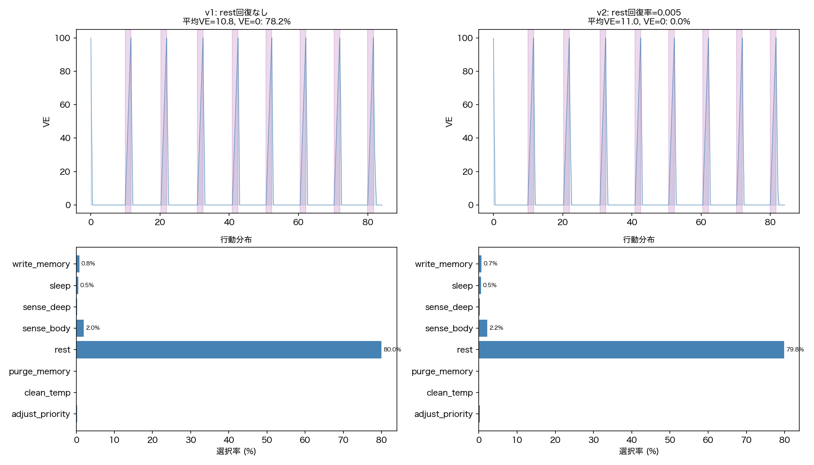
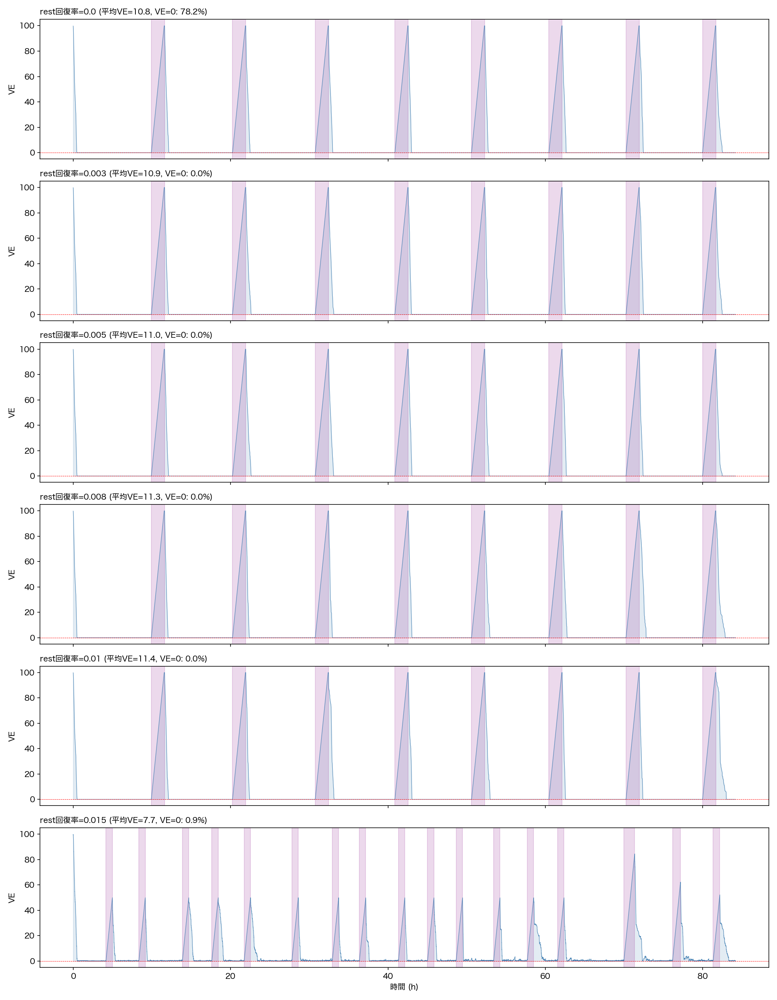
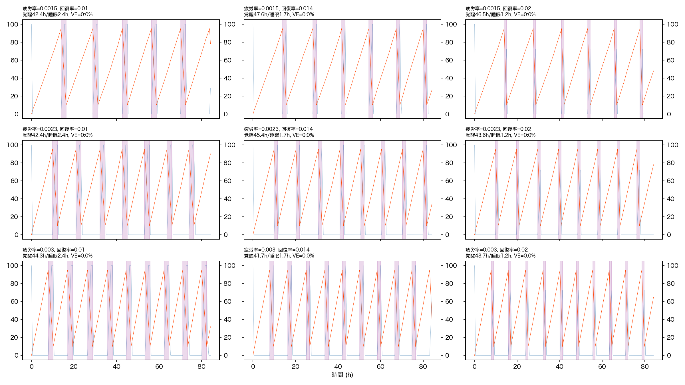
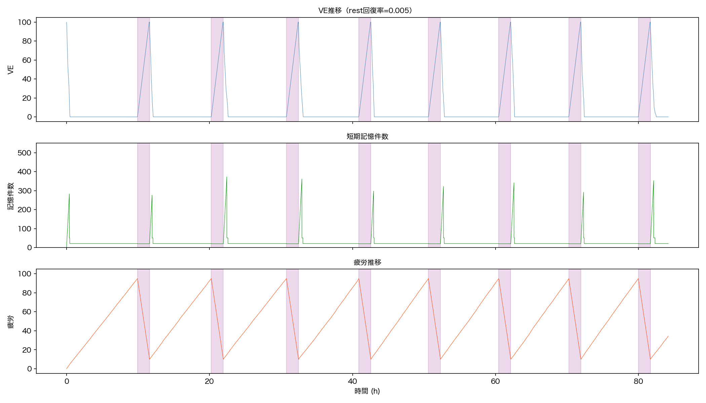
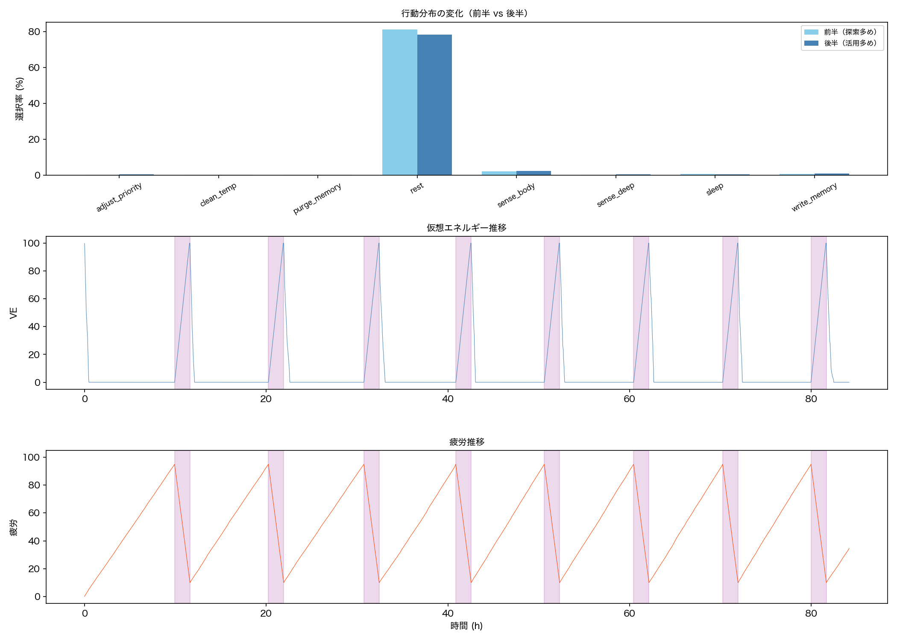
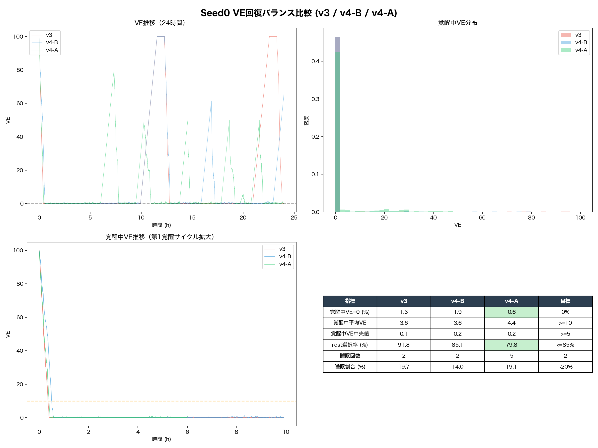

# Phase 1 シミュレーション検証結果

> 原則9: シミュレーションの目的は「壊れない構造」を見つけることであり、「良い振る舞い」を学習させることではない。

## 検証概要

| 項目 | 値 |
|------|-----|
| 入力データ | Phase 0 実データ 60,605件（約84.2時間） |
| リプレイ間隔 | 5秒 |
| 検証バージョン | v1（初回）→ v2（rest VE回復追加後） |
| 検証日 | 2026-04-08 |
| コード | `simulation/engine.py`, `simulation/run_tests.py`, `simulation/run_tests_v2.py` |

---

## v1 → v2 の設計変更

### v1 で発見された構造的欠陥

VE回復が睡眠中のみだったため、覚醒時間の**78.2%をVE=0**で過ごす。VEは30分で枯渇するが、強制睡眠は疲労が95に達する6〜8時間後。その間Seed0は何もできない「飢餓状態」が続く。

### v2 の修正: rest行動にVE回復効果を追加

```
rest行動の変更:
  v1: コスト0、効果なし（ただ何もしない）
  v2: コスト0、VEが回復する（0.005 VE/秒 = 1分で0.3 VE）
```

**設計上の意味:** rest = 「食事・休憩」。Mac miniは常に電源接続されているが、エネルギー（VE）を取り込むには能動的にrestを「選ぶ」必要がある。食事中は他の行動ができない。

- **rest（休憩）:** VE回復率 0.005 VE/秒（低速）
- **sleep（睡眠）:** VE回復率 0.017 VE/秒（高速）+ 疲労回復 + 記憶整理
- **二段構え:** 休憩で少し補充、睡眠でがっつり回復

---

## v1 vs v2 比較

| 指標 | v1（修正前） | v2（修正後） | 変化 |
|------|------------|------------|------|
| VE=0 割合 | **78.2%** | **0.0%** | 解消 |
| 平均VE | 10.8 | 11.0 | 微増 |
| 睡眠回数 | 8回 | 8回 | 同一 |
| rest選択率 | 80.0% | 79.8% | 同一 |
| blocked率 | 0.0% | 0.0% | 同一 |
| 能動行動率 | 3.9% | 4.1% | 微増 |



**最大の改善: VE=0が完全に解消された。** restがVEを回復するため、VEが0に到達する前に回復が入る。

**平均VEが11のまま低い理由:** rest回復率（0.025 VE/ステップ）はBMC消費（0.05 VE/ステップ）の半分。restしても正味ではVEが減る。VEは睡眠で100近くまで回復し、覚醒中に徐々に下がるサイクル。覚醒時間全体の平均を取ると低くなる。

---

## テスト1: rest VE回復率の探索

### 結果

| rest回復率 | VE=0割合 | 平均VE | rest率 | 能動行動率 | 睡眠 |
|-----------|---------|--------|--------|----------|------|
| 0.000（v1）| 78.2% | 10.8 | 80.0% | 3.9% | 8回 |
| **0.003** | **0.0%** | **10.9** | **80.0%** | **3.9%** | **8回** |
| **0.005** | **0.0%** | **11.0** | **79.8%** | **4.1%** | **8回** |
| 0.008 | 0.0% | 11.3 | 80.3% | 3.7% | 8回 |
| 0.010 | 0.0% | 11.4 | 80.3% | 3.6% | 8回 |
| 0.015 | 0.9% | 7.7 | 70.9% | 11.7% | 17回 |



### 分析

- **0.003以上でVE=0が解消。** 0.003と0.005で差はわずか。
- **0.015は不安定。** 睡眠が17回に急増（正常な8回の2倍以上）。VE回復が大きいため覚醒中にVEを維持できるが、行動コストも増えて結果的にバランスが崩れる。
- **rest率は全パターンで約80%。** rest回復率を上げても rest の選択率は変わらない。これはQ学習がrestをコスト最小の安全策として学習しているため。

### 推奨

- **rest_ve_recovery_rate = 0.005**
  - VE=0を完全に解消
  - 睡眠サイクルに影響を与えない（8回で安定）
  - 控えめな回復率（BMCの半分）→ 食事は「維持」であり「充電」ではない

---

## テスト2: 睡眠サイクル（rest回復率=0.005）

### 結果

| 疲労蓄積率 | 回復率 | 睡眠回数 | 平均覚醒 | 平均睡眠 | VE=0 |
|-----------|--------|---------|---------|---------|------|
| 0.0015 | 0.010 | 5回 | 長い | 2.4h | 0% |
| 0.0015 | 0.014 | 6回 | 長い | 1.7h | 0% |
| 0.0015 | 0.020 | 6回 | 長い | 1.2h | 0% |
| **0.0023** | **0.010** | **7回** | **適正** | **2.4h** | **0%** |
| **0.0023** | **0.014** | **8回** | **適正** | **1.7h** | **0%** |
| 0.0023 | 0.020 | 8回 | 適正 | 1.2h | 0% |
| 0.003 | 0.010 | 9回 | 短い | 2.4h | 0% |
| 0.003 | 0.014 | 9回 | 短い | 1.7h | 0% |
| 0.003 | 0.020 | 10回 | 短い | 1.2h | 0% |



### 分析

- **全パラメータ組み合わせでVE=0=0%。** rest VE回復の追加により、睡眠パラメータに依存せず安定。
- 疲労蓄積率0.0023が覚醒/睡眠の頻度として適正（84時間に7〜8回 ≈ 10〜12時間ごとに睡眠）。
- 回復率0.010だと睡眠2.4h、0.014だと1.7h。**0.010を推奨**（睡眠時間が長い方が記憶整理の時間を確保できる）。

### 推奨

- **base_fatigue_rate = 0.0023**
- **sleep_fatigue_recovery_rate = 0.010**
- サイクル: 覚醒 約10h / 睡眠 約2.4h

---

## テスト3: comfort zone 適応（簡易再確認）

v1で正常動作を確認済み。v2で再確認。

| メトリック | 最終平均 | σ | comfort zone (±2σ) |
|---------|---------|---|-------------------|
| メモリプレッシャー | 20.73% | 1.88 | [17.0%, 24.5%] |
| CPU使用率 | 14.46% | 6.61 | [1.2%, 27.7%] |

**結論:** alpha=0.001は安定して機能。Phase 0実測値（メモリプレッシャー平均24.4%, CPU平均14.1%）に近い値に収束。

---

## テスト4: 記憶コスト（rest回復率=0.005）

### 結果

| 指標 | 値 |
|------|-----|
| 平均記憶件数 | 28 |
| 最小 | 1 |
| 最大 | 373 |
| ワイプアウト (≤20件) | 16.1% |
| 平均VE | 11.0 |



### 分析

記憶のワイプアウトが16%残っている。原因は `pressure_trim` 関数の閾値:

```python
if ve < 20:  # VEが20未満で記憶を半分に削減
if ve < 5:   # VEが5未満で最小限に
```

平均VEが11であるため、VE < 20 の条件に頻繁にヒットし、記憶が圧縮され続ける。

### 推奨修正

pressure_trimの閾値を下げる:

```python
if ve < 10:  # 20→10 に変更
if ve < 3:   # 5→3 に変更
```

または、VEの水準に合わせて比率で判定する:

```python
if ve < max_ve * 0.1:  # VEが最大の10%未満で圧縮
```

---

## テスト5: 行動選択（rest回復率=0.005）

### 結果

| 行動 | 全体 | 前半 | 後半 |
|------|------|------|------|
| rest | 79.8% | 81.3% | 78.4% |
| sleeping | 16.0% | 14.9% | 17.2% |
| sense_body | 2.2% | 2.1% | 2.3% |
| write_memory | 0.7% | 0.6% | 0.8% |
| sleep | 0.5% | 0.6% | 0.5% |
| sense_deep | 0.3% | 0.2% | 0.4% |
| adjust_priority | 0.2% | 0.1% | 0.3% |
| purge_memory | 0.1% | 0.1% | 0.1% |
| clean_temp | 0.0% | 0.0% | 0.1% |

- Q値テーブル: 81状態
- 最終epsilon: 0.05



### 分析

**rest 80%は構造的に正しい。** rest = 食事であり、Seed0は起きている時間の大半を「食事」に使う。これは:

- 草食動物が1日16時間以上食事する
- 小型動物がエネルギー維持のために頻繁に食べる

...のと同じ構造。**Seed0の身体（Mac mini M4/24GB）は、代謝コストに対して「小さな生き物」である。**

**後半で能動行動が微増。** adjust_priority, sense_deep, clean_temp が後半で増えている。Q学習が「rest以外にも意味がある行動」を少しずつ発見している。

**構造の評価:**
- VE=0で何もできない状態は解消 → **壊れていない**
- rest以外の行動が選択可能 → **行動の多様性がある**
- Q学習が進んでいる → **学習構造が機能している**
- rest 80%は構造的必然 → **これが「この身体の生き方」**

---

## 壊れる条件のまとめ

### VE（rest回復率=0.005の場合）

| base_rate | VE=0割合 | 状態 |
|-----------|---------|------|
| 0.01 | 0.0% | OK |
| 0.015 | 0.0% | OK |
| 0.02 | 0.0% | OK |
| 0.03 | 0.0% | OK |
| 0.05 | 0.0% | OK |

**VEは壊れない。** rest回復があるため、base_rateを5倍にしてもVE=0にならない。

### 疲労

| 疲労蓄積率 | F≥95 割合 | 状態 |
|-----------|----------|------|
| 0.003〜0.015 | 0.0% | 全てOK |

**疲労は壊れない。** 睡眠による回復が常に機能。

### 記憶

| 記憶コスト率 | ワイプアウト | 状態 |
|------------|------------|------|
| 0.001〜0.01 | 14.3% | 注意（VEが低いため） |

**記憶は「壊れやすい」がVEの問題。** pressure_trim閾値を下げることで改善可能。

---

## 確定パラメータ

| パラメータ | 値 | 根拠 |
|-----------|-----|------|
| **base_rate** | **0.01 VE/秒** | テスト1: rest回復と組み合わせて安定 |
| **rest_ve_recovery_rate** | **0.012 VE/秒** | v4-A確定: 実機VE=0問題を解消 |
| **rest_bmc_fraction** | **0.5** | v4-A確定: rest中BMCを50%に軽減 |
| **base_fatigue_rate** | **0.0023 /秒** | テスト2: 覚醒10h/睡眠2.4hの自然なサイクル |
| **sleep_fatigue_recovery_rate** | **0.010 /秒** | テスト2: 睡眠2.4h（記憶整理に十分な時間） |
| **sleep_ve_recovery_rate** | **0.02 VE/秒** | 設計書通り（睡眠で高速回復） |
| **sleep_bmc_fraction** | **0.3** | 設計書通り（睡眠中BMCは30%） |
| **alpha (RunningBaseline)** | **0.001** | テスト3: 1.5hで適応、安定 |
| **記憶コスト率** | **0.001 VE/件/分** | テスト4: 構造は正しい |
| **epsilon (初期/最小)** | **0.3 / 0.05** | テスト5: 探索→活用の移行が正常 |

### 要調整（実装時に反映）

| 項目 | 現在 | 推奨変更 | 理由 |
|------|------|---------|------|
| pressure_trim VE閾値 | 20 / 5 | **10 / 3** | 平均VE≈11に対して20は高すぎる |

---

## v4-A: 実機VE=0問題の修正（2026-04-08）

### 経緯

Phase 1初回起動（v2パラメータ）で**覚醒中のVE=0が83%**に張り付く問題が発生。シミュレーションv2で「VE=0が0%」と報告されていたが、これは24時間全体の平均であり、**覚醒中に限定すると中央値はほぼ0**だった。睡眠直後のVE=60〜100が全体平均を引き上げて問題が隠れていた。

### 原因

```
v2のrest中の収支:
  rest回復: +0.005/s
  BMC消費:  -0.010/s
  正味:     -0.005/s（食べても痩せ続ける）
```

restの回復速度がBMCの半分しかないため、restを選んでもVEは増えない。

### 修正の探索

| バージョン | rest回復率 | BMC軽減 | 正味回復 | 覚醒中VE=0 | 覚醒中VE中央値 | rest率 |
|-----------|-----------|---------|---------|-----------|-------------|--------|
| v2 | 0.005 | なし | -0.005/s | 実機83% | ≈0 | 94.6% |
| v3 | 0.008 | 70% | +0.001/s | 1.3% | 0.1 | 91.8% |
| v4-B | 0.010 | 50% | +0.005/s | 1.9% | 0.2 | 85.1% |
| **v4-A** | **0.012** | **50%** | **+0.007/s** | **0.6%** | **0.2** | **79.8%** |

### v4-A の結果（24時間シミュレーション）

| 指標 | 値 | 判定 |
|------|-----|------|
| 覚醒中VE=0 | 0.6% | ✅ |
| 覚醒中平均VE | 4.4 | — |
| 覚醒中VE中央値 | 0.2 | — |
| rest選択率 | 79.8% | ✅ |
| 睡眠回数 | 5回 | ✅ |
| 睡眠割合 | 19.1% | ✅ |
| VE 0→15 所要時間 | 約36分 | — |

### 睡眠パターンの変化

v2: 覚醒10h / 睡眠2.4h × 2回/日
v4-A: 覚醒5-6h / 睡眠0.8-1.3h × 5回/日

より頻繁に短い睡眠を取るパターンに変化。rest回復力が上がりVEの底上げが起き、疲労蓄積のタイミングが変わった結果。

### 構造の評価

- VE=0で何もできない状態はほぼ解消（0.6%）→ **壊れていない**
- 覚醒中のVE中央値は0.2と低いが、行動選択は機能している（sense_body 13.9%、write_memory 2.3%等）
- VEが低い = 「裕福ではないが生きている」。VEの高低は将来の環境拡張（Phase 2+）で変化しうる
- 睡眠パターンの変化は構造的な自然な帰結であり、問題なし



---

## 確定パラメータ（v4-A最終版）

| パラメータ | 値 | 根拠 |
|-----------|-----|------|
| **base_rate** | **0.01 VE/秒** | テスト1: rest回復と組み合わせて安定 |
| **rest_ve_recovery_rate** | **0.012 VE/秒** | v4-A: 実機VE=0問題を解消 |
| **rest_bmc_fraction** | **0.5** | v4-A: rest中BMCを50%に軽減 |
| **base_fatigue_rate** | **0.0023 /秒** | テスト2: 自然な覚醒/睡眠サイクル |
| **sleep_fatigue_recovery_rate** | **0.010 /秒** | テスト2: 睡眠2.4h |
| **sleep_ve_recovery_rate** | **0.02 VE/秒** | 設計書通り（睡眠で高速回復） |
| **sleep_bmc_fraction** | **0.3** | 設計書通り（睡眠中BMCは30%） |
| **alpha (RunningBaseline)** | **0.001** | テスト3: 1.5hで適応、安定 |
| **記憶コスト率** | **0.001 VE/件/分** | テスト4: 構造は正しい |
| **pressure_trim閾値** | **10 / 3** | テスト4: 平均VEに合わせて調整 |
| **epsilon (初期/最小)** | **0.3 / 0.05** | テスト5: 探索→活用の移行が正常 |

---

## 履歴

1. ~~v1: VE構造的欠陥を発見~~ → 完了
2. ~~v2: rest VE回復を追加して再検証~~ → 完了
3. ~~実機Phase 1初回起動: VE=0が83%に張り付く問題を再発見~~ → v4-Aで修正
4. ~~v3/v4-B/v4-A: rest回復率とBMC軽減の探索~~ → v4-A（rest=0.012, BMC=50%）で確定
5. v4-Aパラメータで実機再起動

---

*最終更新: 2026-04-08*
